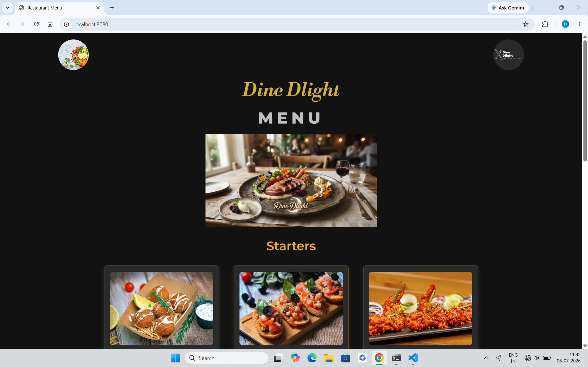
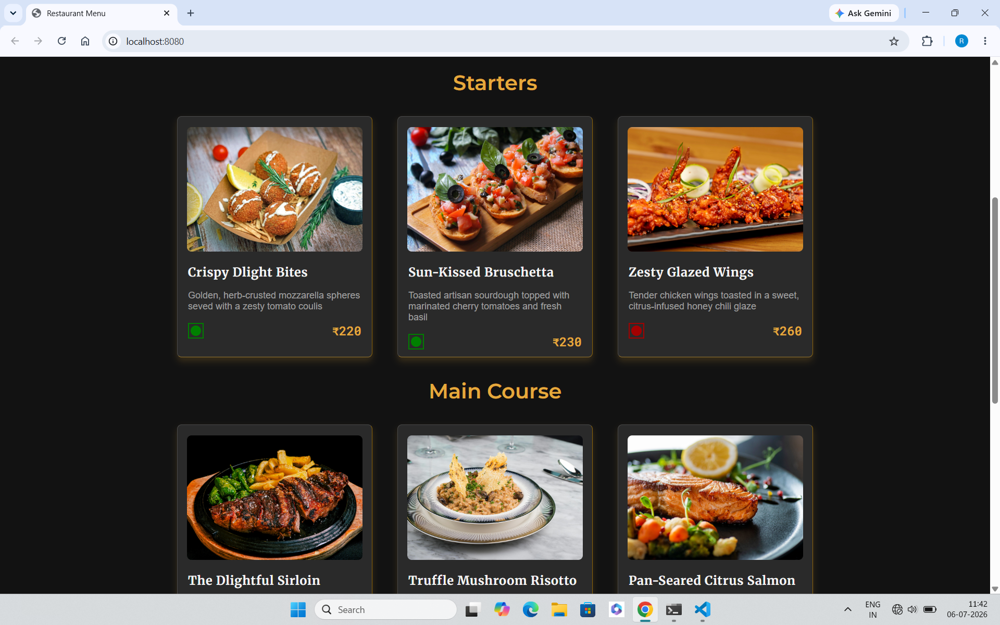
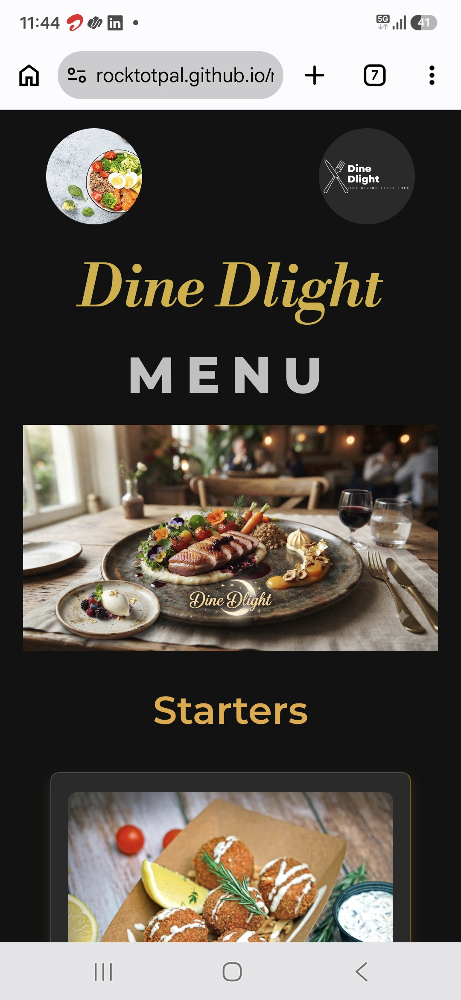
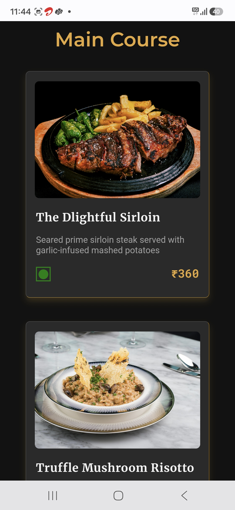

# restaurant-menu

## Overview

Display a restaurant's food menu, allowing customers to browse dishes by category, compare prices, and explore available options.

## Features

Browse dishes by category
View high quality food image
View dish names
Read a short food descriptions
Check Vegetarian or Non-vegetarian indicator
View Price

## Technologies Used

- HTML5
- CSS3
- Flexbox
- Google Fonts

## What I learned

- Planning a project before writing code
- Structuring HTML using semantic elements
- Planning CSS before implementation
- Building responsive layout using only flexbox
- Adjasting layout between development according to the project need
- Typography and color combination
- Cards creation and styling
- Specially use of combined border and shadow properties to provide a premium look to the cards

## Challenges Faced

- Adjasting the cards shadow in dark shades to provide a premium look
- Maintaining consistent spacing and alignment across all cards

## Future Improvements

- Search dishes
- Category tabs
- Filter Veg/Non-Veg
- Online ordering
- Customer reviews
- Ratings
- Dark mode

## ScreenShot

# Desktop view

# Mobile view

# Live demo

[Live Demo](https://rocktotpal.github.io/restaurant-menu/)

## Folder Structure

restaurant-menu/

│── images/

│── index.html

│── plan.md

│── README.md

│── style.css
